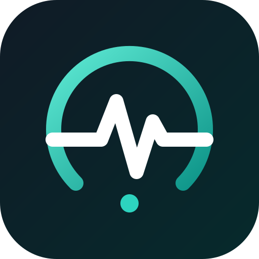
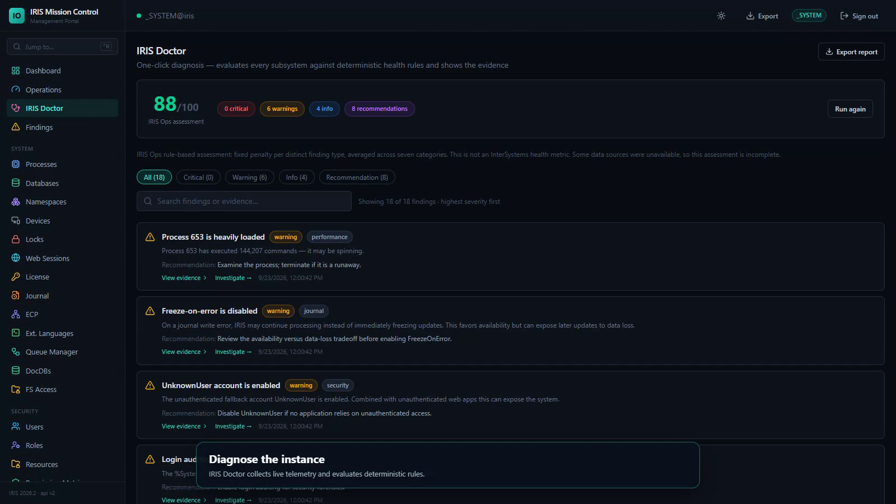
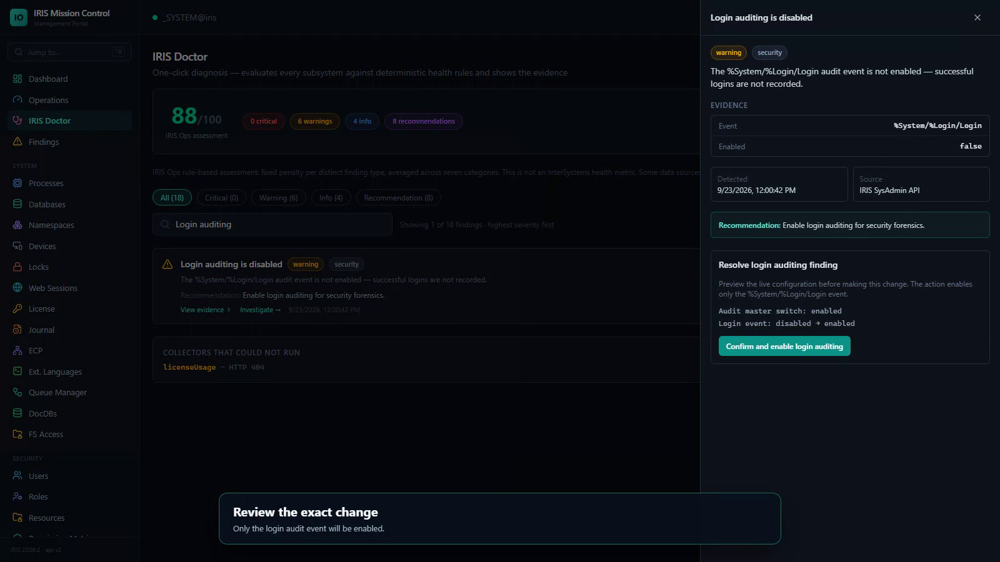
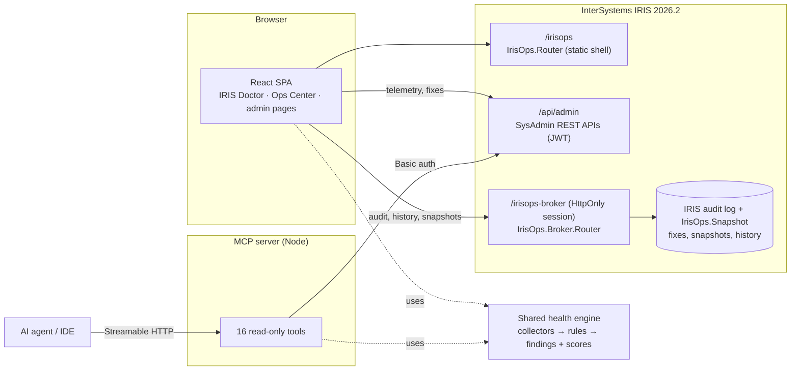

#  IRIS Mission Control

**Diagnose your InterSystems IRIS instance, see the evidence, and fix it safely — from a browser or an AI agent.**

[](https://github.com/Fruitkwan/IRIS_Mission_Control/actions/workflows/ci.yml)
[](LICENSE)


**[▶ Watch the 4-minute demo video](https://youtu.be/S-pdnruZOUE)**

<!--
  Add these links once they exist:
  · **[Try the live demo](DEMO_URL)** · [Developer Community article](ARTICLE_URL) · [Open Exchange](OPEX_URL)
-->


## In 30 seconds

Operators don't want forty admin screens. They want to know what is wrong with
the instance, how sure the tool is, and how to fix it without breaking anything.
IRIS Mission Control is a modern portal built on the
[`/api/admin` SysAdmin APIs](https://github.com/intersystems-community/sysadmin-api-specification).
At its center is **IRIS Doctor**.

- **Diagnose:** IRIS Doctor reads live telemetry and runs deterministic rules.
  Every finding it reports comes with evidence.
- **Fix:** the change is previewed field by field, applied, verified, and
  recorded in the IRIS audit log, with a one-click undo.
- **AI agents:** an MCP server gives them the same findings.

## What makes it different

1. **Findings you can check.** 28 deterministic rules cover databases,
   journals, locks, security, audit, web apps, tasks, certificates and
   licensing. Each finding shows the raw evidence it is based on and links to
   the exact page where you can act on it. Every rule has a test, and CI fails if
   a rule is added without one.
2. **Fixes you can trust.** Five findings can be fixed from the finding drawer:
   - **Preview:** the exact before/after values from live IRIS.
   - **Confirm:** the configuration is re-read first, and the fix is refused if
     it changed since the preview.
   - **Apply and verify:** the fix is confirmed with a fresh read.
   - **Audit:** a real IRIS audit record is written under your username.
   - **Undo:** restores the exact previous values.
3. **One engine, two interfaces.** The portal and the MCP server share the same
   collectors and the same rules. When Claude, ChatGPT or an IDE agent asks
   "is my IRIS healthy?", it gets the same evidence-backed findings you see.

## Judge this first — a 5-minute walkthrough

```bash
git clone https://github.com/Fruitkwan/IRIS_Mission_Control.git irisops
cd irisops
docker compose up -d --build        # wait until `docker ps` shows irisops (healthy)
```

1. Open **http://localhost:52773/irisops/** and sign in as `_SYSTEM` / `SYS`.
2. Open **IRIS Doctor** from the sidebar, or go to
   http://localhost:52773/irisops/#/doctor. Click **Diagnose IRIS**.
3. Find **"Freeze-on-error is disabled"**. It is disabled in the default
   container. Click **View evidence**, then **Preview change**. You will see
   `FreezeOnError: false → true` with the scope, the operational impact and the
   rollback.
4. Click **Confirm and enable journal freeze-on-error**. IRIS confirms the
   change with a fresh read, and the drawer shows it was recorded in the IRIS
   audit log.
5. Click **Run diagnostics and compare**. The finding is gone, the score goes
   up, and **Change history** shows who changed what.
6. Open **Time Machine** (sidebar → Observability) to see the before/after
   snapshots.
7. Ask the MCP server for the same assessment:

   ```bash
   curl -s -X POST http://localhost:3333/mcp -H 'Content-Type: application/json' \
     -H 'Accept: application/json, text/event-stream' \
     -d '{"jsonrpc":"2.0","id":1,"method":"tools/call","params":{"name":"iris_get_health","arguments":{}}}'
   ```

8. Optional: re-open the finding and click **Undo change**. The previous value
   is restored, and an `IrisOps/Remediation/Rollback` record is written.

<table>
<tr>
<td></td>
<td></td>
</tr>
<tr>
<td align="center">Evidence-backed findings, highest severity first</td>
<td align="center">Review the exact change before applying it</td>
</tr>
</table>

## Compared with the classic Management Portal

| Task | Classic Management Portal | IRIS Mission Control |
|---|---|---|
| Find what needs attention | Check each subsystem's page and the dashboard indicators | One diagnosis across 19 data sources, with findings ranked by severity and evidence for each |
| Understand a problem | Read raw settings | Each finding explains the operational impact and links to the page that fixes it |
| Change a risky setting | Edit a form and save | Field-level preview, check for concurrent changes, verification, then undo (for five findings) |
| Know who fixed what | Depends on which system audit events are enabled | Every fix writes `IrisOps/Remediation/Apply` or `/Rollback` with the before and after values |
| AI and automation | — | MCP server with 16 read-only tools sharing the Doctor's rules |

IRIS Mission Control is built only on `/api/admin`. Anything that API does not
expose still needs the classic portal.

## Community Idea implemented

[**DPI-I-966 — Option to show older message.log in IRIS SMP**](https://ideas.intersystems.com/ideas/DPI-I-966)
(status: Community Opportunity).

The classic portal only shows the current `messages.log`. After a log switch,
for example one forced by mirror trouble, you have to log in to the server to
read `messages.old_*`. IRIS Mission Control's **Messages Log** page (sidebar →
System) handles this from the portal:
- lists `messages.log` and every rotated `messages.old_*` file
- shows the last 200–5000 lines of any of them, newest first
- filters by severity and searches by text or source

The "serious system alert" finding in IRIS Doctor links straight to it. It is
read-only, served by `IrisOps.MessagesLog` on the broker, and requires
`%Admin_Operate` or `%Admin_Manage`. It only accepts those log file names, so it
cannot read any other file.

## Tested with

| Component | Version |
|---|---|
| InterSystems IRIS | IRIS for UNIX 2026.2 (Build 221U), Community Edition, image `intersystemsdc/iris-community:2026.2-zpm` |
| Node.js (build and MCP) | 22 in CI and Docker; 24 locally |
| Browser | Chromium (Playwright demo recording) |

Other editions, including IRIS for Health with real FHIR endpoints, have not been
tested yet.

## Architecture



- `frontend/src/health/`: the engine. `collect.ts` gathers telemetry and is
  used by both the portal and MCP. `rules.ts` holds the 28 rules and the
  scoring. `remediation.ts` holds the fixes.
- `src/cls/IrisOps/`: IRIS classes.
  - `Router` serves the SPA.
  - `Broker.Router` is the authenticated broker (HttpOnly session cookie).
  - `Remediation` writes and reads the audit records; `Audit` is the shared writer.
  - `Snapshot` stores Time Machine and Config Drift snapshots.
  - `Setup` runs at install: creates the audit events and configures the broker session.
  - `CloudBroker` runs server-side cloud checks.
- `mcp-server/`: the standalone MCP service.
- `frontend/src/api/generated/`: a typed client generated from the OpenAPI spec.

## Features

<details>
<summary><b>Full feature list</b></summary>

### Intelligence
- **IRIS Doctor** (`/doctor`): one-click diagnosis with evidence-backed
  findings, recommendations, deep links, Markdown export and safe remediation.
- **Operations Center** (`/operations`): a rule-based score for each subsystem
  and a finding feed ranked by severity.
- **Rule coverage:**
  - database mount and read-only state
  - journal space and freeze-on-error
  - lock table
  - serious system alerts
  - instances that have never been backed up
  - insecure or unauthenticated services and web apps
  - default accounts
  - disabled login auditing
  - suspended or failed tasks
  - expiring certificates
  - license saturation
  - runaway processes
- **Scoring:** each distinct finding type costs one penalty. Scores help you
  prioritize; they are not InterSystems health metrics. If a data source
  cannot be read, the report marks the assessment as incomplete.

### Safe remediation
| Finding | Fix |
|---|---|
| Login auditing disabled | Enables only `%System/%Login/Login`. Blocked while the master audit switch is off. |
| Unauthenticated custom web app | Clears only the Unauthenticated flag. The portal's own `/irisops` shell is protected. |
| Journal freeze-on-error disabled | Sets `FreezeOnError`; every other journal setting is sent back unchanged. |
| Suspended task | Resumes only that task, after showing its class, namespace and next run. |
| Certificate expiring or expired | Guided steps, then a check of the new expiry date. Certificates are never generated or uploaded. |

### Management portal
- Live dashboard, process manager (suspend / resume / terminate / broadcast)
- Databases and volumes, namespaces and mappings, devices, locks, web
  sessions, license, journal, ECP, work-queue manager, DocDB, filesystem access
- **Security center:**
  - users, roles and resources
  - services, and a permission matrix
  - audit
  - LDAP, SSL/TLS and encryption
  - web auth and MFT
  - SQL privileges and privileged routines
- **Secrets:** wallet collections, X.509 credentials and OAuth 2.0
- **Tasks:** list, run, suspend, resume, history and upcoming runs
- **Web applications**, plus a REST API explorer over the full OpenAPI spec
- **Unified log console:** API activity, audit, task history and journal in
  one place, with incident grouping

### AI and agent interface
- **MCP server** (Streamable HTTP) with 16 read-only tools, for example
  `iris_get_health`, `iris_list_databases` and `iris_get_audit_events`.
  - Every call is audited, with secret-looking arguments redacted.
  - The audit is visible on the `/mcp` page.

### Healthcare
- **FHIR Control Center:** discovers `/fhir*` web apps, then probes
  `/metadata` and reports the version, resources and latency.
- FHIR resource explorer, CapabilityStatement visualizer and resource
  validator.
- A clearly labeled synthetic demo server, so the FHIR screens work on
  Community Edition.

### Cloud
- **Cloud secrets broker:**
  - live checks of Azure Key Vault client credentials
  - a connection registry for AWS Secrets Manager and GCP Secret Manager
  - the IRIS wallet as a local provider
- Secrets are resolved from the wallet on the server. Secret values and
  access tokens never reach the browser.

### Observability
- **Time Machine:** capture operational snapshots and compare any two points in time.
- **Configuration Drift:** diff users, roles, resources, web apps, services,
  SSL and journal configuration between snapshots.
- **Universal search** (`Ctrl+K`) across pages and live entities, and a
  one-click JSON export of the instance configuration.

</details>

## Install

### Docker

```bash
docker compose up -d --build
```

- Portal: **http://localhost:52773/irisops/** (`_SYSTEM` / `SYS`)
- MCP endpoint: **http://localhost:3333/mcp**. Status, tool list and audit
  are at `http://localhost:3333/status`, `/tools` and `/audit`.

> The compose file starts IRIS with `/iris-main` directly. This skips the
> `-zpm` base image's first-boot hook, which fails on an upstream `dbapi`
> regression ([#3](https://github.com/Fruitkwan/IRIS_Mission_Control/issues/3)).
> The image doesn't need it: everything is installed at build time.

> **Upgrading an existing stack:** the `irisops-data` volume holds the IRIS
> databases, so `--build` alone keeps the previously installed classes. Run
> `docker compose down -v` first to start from the new image. This deletes
> local data such as snapshots.

### Existing instance (ZPM)

Requires IRIS 2026.2+. From the community package registry:

```
zpm "install iris-mission-control"
```

Or from a clone of this repository (the prebuilt `web/` bundle is committed):

```
zpm "load /path/to/irisops"
```

This registers two web applications:
- `/irisops` serves the portal shell through `IrisOps.Router`. The shell loads
  without authentication so the login page can appear. Every API call is
  authenticated by `/api/admin`.
- `/irisops-broker` requires IRIS authentication and the `%Admin_Secure`
  privilege. It serves the remediation audit and history, the Time Machine and
  Config Drift snapshots, and the server-side cloud connection tests.

The install step `IrisOps.Setup` creates the `IrisOps/*` audit events and
configures the broker's session cookie.

### MCP client setup

```json
{ "mcpServers": { "irisops": { "url": "http://localhost:3333/mcp" } } }
```

Then ask: *"Check my IRIS instance and identify anything requiring
attention."* The MCP server reads `IRIS_URL`, `IRIS_USER` and `IRIS_PASSWORD`
from its environment (see `.env.example`).

## Development and testing

```bash
docker run -d --name iris-dev -p 1972:1972 -p 52773:52773 intersystemsdc/iris-community:2026.2-zpm
cd frontend && npm ci && npm run dev          # http://localhost:5173, proxies /api to :52773
cd mcp-server && npm ci && IRIS_URL=http://localhost:52773/api/admin npm start
```

| Command | Purpose |
|---|---|
| `npm test` | Rule, scoring, collector and remediation tests (frontend); secret-redaction tests (mcp-server) |
| `npm run build` | Type-check and production build into `web/` |
| `npm run lint` | oxlint; any warning fails the build |
| `npm run generate` | Regenerate the typed API client from the OpenAPI spec |
| `npm run record:demo` | Record the captioned IRIS Doctor demo video (see `demo/README.md`) |

**Tests** (`frontend/tests/`):
- Every rule is tested for its trigger, severity, category, evidence and deep
  link. A meta-test fails if a rule is added without a test case.
- Sample SysAdmin API responses are run through the shared collector,
  including partial collector failures.
- Every fix is tested against an in-memory IRIS for preview, drift refusal,
  apply and verify, and exact rollback.
- Config drift and the Time Machine before/after preselection are tested.

**CI** (`.github/workflows/ci.yml`):
- runs lint, the tests and the production build
- boots the MCP server
- brings up the full Docker stack and checks the IRIS healthcheck, the portal,
  `/api/admin`, and MCP's connection to IRIS

## Security model

- **Content-Security-Policy:** the portal only runs scripts from its own
  origin, so injected inline scripts and event handlers are blocked. Scripts
  can only connect to the portal itself and the MCP server, which stops
  exfiltration to any other address.
  - The policy is sent as headers by `IrisOps.Router` and embedded in
    `index.html`.
  - It also sends `frame-ancestors 'none'`, `nosniff` and a same-origin
    referrer policy.
  - To allow extra origins, such as an external FHIR server, set
    `^IrisOps("security","connect-src")`.
- **Portal API tokens:** `/api/admin` issues JWTs, which the SPA keeps in
  `localStorage` with transparent refresh.
  - Cross-site scripting is the threat this guards against. The CSP above
    blocks injected scripts, and the app code never injects raw HTML.
  - A future step is a backend-for-frontend that keeps these tokens server-side.
- **Broker session:** the broker holds no browser-readable token. The user
  authenticates once at login, and the session lives in an HttpOnly,
  SameSite=Strict cookie.
  - State-changing requests must carry an `X-Requested-With` header, which
    cross-site pages cannot send (CSRF protection).
  - Remediation, history and snapshot routes also require `%Admin_Secure`.
  - Unlike broker JWTs, the session is not invalidated when a fix changes IRIS
    security settings.
- **Shared, durable state:** snapshots and remediation history live in IRIS,
  not the browser.
  - Snapshots record who captured them. The newest 200 metric snapshots and
    50 config snapshots are kept.
  - Creating or deleting a snapshot writes an `IrisOps/Snapshot/*` audit
    record.
- **No arbitrary execution:** no endpoint runs arbitrary SQL, ObjectScript or
  shell commands.
- **Remediation:**
  - Each fix is a fixed, allow-listed change.
  - The audit endpoint copies only known fields into the IRIS audit log, and
    records the authenticated IRIS user.
- **MCP:** tools are allow-listed and read-only. Arguments are redacted
  recursively before they are audited.
- **Cloud secrets:** values are never rendered. A live connection test
  retrieves one value inside the broker to prove access, then discards it.
- **FHIR:** demo content is synthetic and clearly labeled.

## License

MIT
